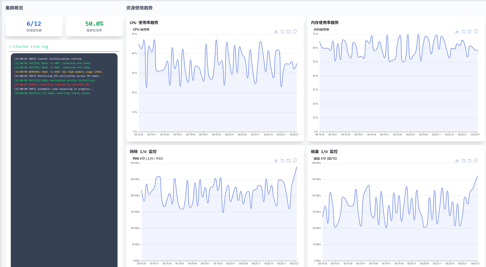
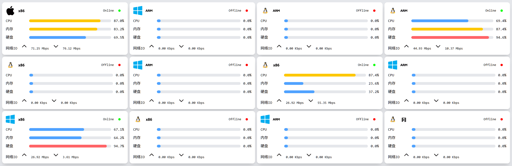

# 🛰️ KProbe-Web

**KProbe** 是一款用于服务器（集群）状态探测与监控的轻量级探针系统。
本项目 **KProbe-Web** 为其 **前端演示 Demo**，主要用于展示系统可视化界面与数据交互逻辑。

---

## ✨ 项目简介

KProbe-Web 基于 **Vue 3 + Vite + TypeScript + Pinia** 构建，结合 **Tailwind CSS** 进行快速样式开发，重点展示 KProbe 系统的前端可视化与状态管理方案。

🔹 **主要特性**

- 📘 使用 **TypeScript 接口定义**，明确前后端数据结构，保证类型安全
- ⚡ **路由守卫（Navigation Guards）** 实现页面级数据预加载，提升加载效率与体验
- 🧩 **Mock.js 模拟后端 API**，支持前后端分离开发与快速联调
- 💅 **Tailwind CSS** 提供高效的响应式布局与现代化 UI 风格

---

## 🖼️ Preview

<div align="center">
  <h4>📊 可视化大屏</h4>
  
  <h4>🧭 详情页</h4>
  
</div>

---

## 🧩 技术栈

| 分类     | 技术         |
| -------- | ------------ |
| 前端框架 | Vue 3        |
| 构建工具 | Vite         |
| 状态管理 | Pinia        |
| 语言     | TypeScript   |
| UI 框架  | Tailwind CSS |
| 数据模拟 | Mock.js      |

---

## 🚀 快速启动

```bash
# 安装依赖
npm install

# 启动开发环境
npm run dev
```

启动后访问开发服务器（通常为 `http://127.0.0.1:5173/`），即可预览演示页面。

---

## 🧠 项目说明

本项目仅用于 **演示与教学目的**，当前版本为前端可视化 Demo，暂不包含真实后端通信逻辑。
未来版本计划支持与真实后端服务（可能基于 **Golang**）的集成，以实现完整的监控与数据交互功能。
